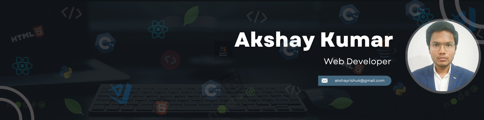

<!--h1 without bottom border-->

  <ul align="center">
    
<h1 style="display: inline-block">Hi 👋, I'm Akshay Kumar</h1>

  </ul>

<!--horizontal divider(gradiant)-->

<!--  -->

  

<h2 align="center">👨‍💻 About Me</h2>
<h5 align="center">
  🌱 I'm currently pursuing a <b>Bachelor of Technology (BTech)</b> and exploring the vast world of <b>web development</b> and <b>data structures & algorithms (DSA)</b>. 
  💡 I’m passionate about building <b>innovative projects</b> that solve real-world problems and enhance <b>user experiences</b>. I'm also diving into <b>open source contributions</b>. 
  💞 I’m always open to collaborating on impactful web development projects or any exciting challenge that pushes the boundaries of technology. 
  📌 <b>Let’s connect</b> on my social media: 
</h5>

  
  

## 💻 Tech Stack & Skills
- **Languages**:
  
  

- **Frontend**:
  
  
  
  
  

- **Backend**:
  
  
  
- **Other Tools**:
  
  
  
  
 
- **Learning**: Data Structures and Algorithms (DSA), Open-source contributions, Backend with Node.js, and more!

---
### 📊 GitHub Stats:

<!--- stats & Trophy (start) -->

  <!--- stats (start) -->
<table align="center">
<tr border="none">
<td width="50%" align="center">
  
  
    
   
</td>

<td width="50%" align="center">

  
  
  </td>
</tr>
</table>
<!--- stats (end) -->

<!--- trophy (start) -->

  

<!--- trophy (start) -->

### ✍️Random Dev Quote

## 🌱 Currently Learning
- Full-stack development (Express.js, MongoDB)
- Open-source contributions
- GSoC 2025 prep

---

## 🛠 Projects
Here are some of my favorite projects:
- **[Portfolio Website](https://akshay0712-dev.github.io/portfolio/)**: A personal portfolio showcasing my skills, projects, and journey as a developer.
- **[CampusDocs](https://github.com/akshay/CampusDocs)**: A platform for accessing essential student documents and college WhatsApp groups.
- **[7-day React Challenge](https://akshay0712-dev.github.io/project/)**: I'm currently building 7 React projects in 7 days to enhance my skills.

Check out my repositories to explore more projects!

---

## 📫 How to Reach Me
- **LinkedIn**: [LinkedIn](https://www.linkedin.com/in/akshay-kumar-93b487215/)
- **Email**: [Email](akshayrishu4@gmail.com)

---

